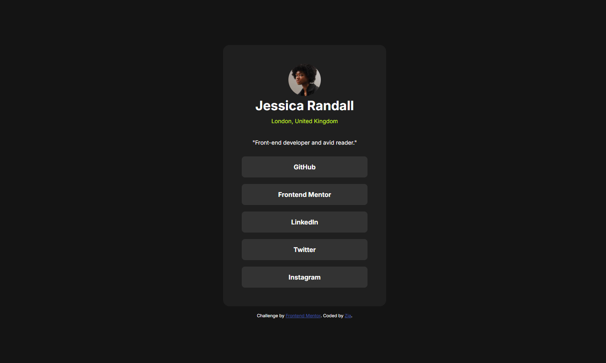

# Frontend Mentor - Social links profile solution

This is a solution to the [Social links profile challenge on Frontend Mentor](https://www.frontendmentor.io/challenges/social-links-profile-UG32l9m6dQ). Frontend Mentor challenges help you improve your coding skills by building realistic projects.

## Table of contents

- [Overview](#overview)
  - [The challenge](#the-challenge)
  - [Screenshot](#screenshot)
  - [Links](#links)
- [My process](#my-process)
  - [Built with](#built-with)
  - [What I learned](#what-i-learned)
  - [Continued development](#continued-development)
- [Author](#author)

## Overview

### The challenge

Users should be able to:

- See hover and focus states for all interactive elements on the page

### Screenshot



### Links

- Solution URL: [Submit di Frontend Mentor terlebih dahulu](#)
- Live Site URL: [Add live site URL here](https://your-username.github.io/social-links-profile/)

## My process

### Built with

- Semantic HTML5 markup (`<main>`, `<article>`, `<ul>`, `<li>`)
- CSS custom properties (Variables)
- Flexbox
- Mobile-first approach

### What I learned

In this challenge, I practiced structuring semantic HTML for a social links profile card by using an unordered list (`<ul>`) with anchor tags (`<a>`) instead of generic buttons. I also implemented `:hover` states and transitions for the interactive link buttons.

```html
<ul class="social-links">
  <li>
    <a href="[https://github.com](https://github.com)" target="_blank"
      >GitHub</a
    >
  </li>
  <li>
    <a
      href="[https://www.frontendmentor.io](https://www.frontendmentor.io)"
      target="_blank"
      >Frontend Mentor</a
    >
  </li>
  <li>
    <a href="[https://linkedin.com](https://linkedin.com)" target="_blank"
      >LinkedIn</a
    >
  </li>
  <li>
    <a href="[https://twitter.com](https://twitter.com)" target="_blank"
      >Twitter</a
    >
  </li>
  <li>
    <a href="[https://instagram.com](https://instagram.com)" target="_blank"
      >Instagram</a
    >
  </li>
</ul>
```

```css
.social-links a {
  display: block;
  text-decoration: none;
  color: var(--white);
  font-weight: 700;
  background-color: var(--gray-700);
  padding: 16px;
  border-radius: 8px;
}

.social-links a:hover {
  color: var(--gray-900);
  background-color: var(--green);
}
```

## Continued development

- Advanced keyboard navigation and :focus-visible accessibility styles.
- Creating fully responsive multi-component layouts using CSS Grid and Flexbox.

## Author

- Frontend Mentor - [@Zia](https://www.frontendmentor.io/profile/Zia)
